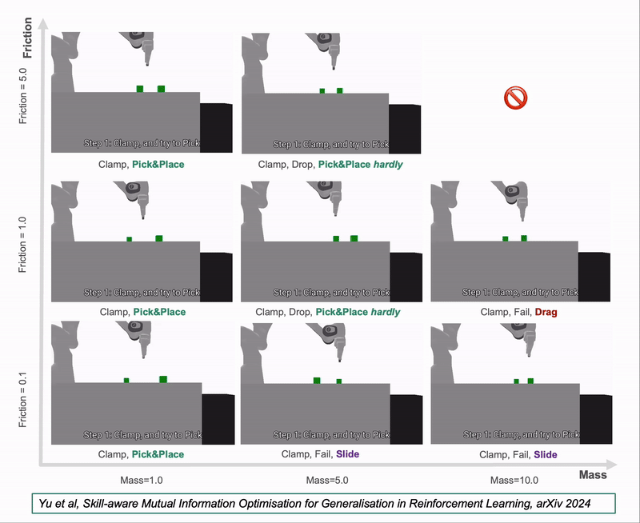

# Skill-aware Mutual Information (SaMI)

This is the official implementation of Skill-aware Mutural Information (SaMI) from the paper Skill-aware Mutual Information Optimisation for Generalisation in Reinforcement Learning. on arxiv: https://arxiv.org/pdf/2406.04815

by [Xuehui Yu](https://github.com/yuxuehui), [Mhairi Dunion](https://github.com/mhairidunion), [Xin Li](https://github.com/loxs123), [Stefano V. Albrecht](https://agents-lab.org/stefano-albrecht/)

**Challenge Problem:**
Meta-Reinforcement Learning (Meta-RL) agents can struggle to operate across tasks with varying environmental features that require different optimal skills (i.e., different modes of behaviours). An ideal RL algorithm should be able to learn a single policy to perform multiple tasks and generalise to new and unseen tasks.


**Please see our a SlidesLive demonstration video at 👉 [SaMI SlidesLive](https://recorder-v3.slideslive.com/?share=96779&s=cffc27e8-d386-41fb-8ab6-fe82a11990e3) or a short version:**

https://github.com/user-attachments/assets/e51ef0d6-4689-41b0-947e-fa4b5e7fb5cb

SaMI can be used alone or combined with other optimisation objectives to train context encoders in Meta-RL algorithms. In this repository, we provide implementations of two baselines: [CCM](https://cdn.aaai.org/ojs/16914/16914-13-20408-1-2-20210518.pdf) and [TESAC](https://arxiv.org/pdf/1910.10897). We have equipped these baselines with SaMI, resulting in SaCCM and SaTESAC.

### 🤖 🤖 Our Skill-aware Robot 👏 👏

#### Modified Panda-gym

Our [modified Panda-gym](https://github.com/uoe-agents/Skill-aware-Panda-gym) is based on the the [Panda-gym](https://github.com/qgallouedec/panda-gym). The environments consist of a Panda robotic arm from [Franka Emika](https://franka.de/) that has 7 degrees of freedom and a parallel finger gripper.

During the training process, we alter the values of cube mass and table friction. In the test setting, we test on previously unseen mass and friction values. The following shows the training and testing videos of SaCCM on different tasks (0.5x speed):

<p align=center>

</p>

#### Crippled Half-Cheetah

During the training process, we alter the values of mass and damping and randomly cripple ***one of the front leg joints*** (joint 3, 4 or 5). In the test setting, we test on previously unseen mass and damping values. More importantly, in the moderate test setting, we randomly cripple ***one of the back leg joints*** (joint 0, 1 or 2). In the extreme test setting, we increase the difficulty by randomly crippling ***two joints from both the front and back legs***. We found that SaCCM and SaTESAC can adjust the running posture of the Half-Cheetah to cope with different crippled joints, thereby running as far as possible using different modes of running (i.e., different skills). The following shows the training and testing videos of SaCCM on different tasks (first 60 seconds, 2x speed):

<p align=center>
    </p>
<p align=center>
  
</p>

And some faliure cases of CCM:

<p align=center>
   
</p>
<p align=center>
  
</p>

#### Crippled Ant

During the training process, we alter the values of mass and damping, and randomly cripple one of legs (leg 0, 1, 2 or 3). In the test setting, we test on previously unseen mass and damping values. More importantly, in the extreme test setting, we also randomly cripple two legs. ***When 3 or 4 legs are available, the Ant Robot (trained with SaCCM and SaTESAC) rolls to adapt to varying mass and damping. However, with only 2 adjacent legs during zero-shot generalisation, it switches to walking. If 2 opposite legs are available, the Ant can still roll but eventually tips over.*** The following shows the training and testing videos of SaCCM on different tasks (first 60 seconds, 2x speed):

<p align=center>
   
</p>

#### Hopper

During the training process, we alter the values of mass and damping. In the test setting, we test on previously unseen mass and damping values. In the Hopper environment, we found that in order to adapt to different mass values, the TESAC/CCM/SaTESAC/SaCCM policy tends to learn only one skill, which is ***the Hopper hopping forward on the floor***. The following shows the training and testing videos of SaTESAC on different tasks (first 180 seconds, 6x speed):

<p align=center>
  </p>
<p align=center>  
</p>

#### Crippled Hopper

During the training process, we alter the values of mass and damping. In the test setting, we evaluate on previously unseen mass and damping values. More importantly, in the extreme test setting, we randomly disable one joint (i.e., joints 0, 1, or 2). SaCCM and SaTESAC learned to ***take a big hop forward at the beginning (i.e., effective exploration)*** and then switch to different skills based on environmental feedback. The following shows the training and testing videos of SaCCM on different tasks (first 100 seconds, 4x speed):

<p align=center>
    </p>

And some faliure cases of CCM:

<p align=center>
    
</p>

#### Walker

During the training process, we alter the values of mass and damping. In the test setting, we test on previously unseen mass and damping values. In the Walker environment, we found that in order to adapt to different mass values, the TESAC/CCM/SaTESAC/SaCCM policy tends to learn only one skill, which is ***the Walker hopping forward on the floor through both right and left legs***. The following shows the training and testing videos of SaTESAC on different tasks (first 180 seconds, 6x speed):

<p align=center>
   </p>
<p align=center>  
</p>

#### Crippled Walker

During the training process, we alter the values of mass and damping, and randomly disable the right leg (i.e., three joints 0, 1, and 2). In the test setting, we evaluate on previously unseen mass and damping values. More importantly, in the moderate test setting, we randomly disable one joint of the right leg (i.e., joints 0, 1, or 2); in the extreme test setting, we also randomly disable the left leg (i.e., three joints 3, 4, and 5) or one joint of the left leg (i.e., joint 3, 4, or 5). ***The Crippled Walker (trained with SaTESAC and SaCCM) learned to hop forward using the right leg in the training and moderate test tasks, and zero-shot generalised to hopping forward using the left leg in the extreme test tasks.*** The following shows the training and testing videos of SaCCM on different tasks (first 180 seconds, 6x speed):

<p align=center>
   
</p>

<p align=center>
   
</p>

#### Half-Cheetah

During the training process, we alter the values of mass and damping. In the test setting, we test on previously unseen mass and damping values. In the Half-Cheetah environment, during zero-shot generalisation, SaCCM demonstrates different skills for ***running forwards at various speeds*** , as well as skills for ***doing flips and faceplanting*** (when mass = 0.25 and damping = 0.25).The following shows the training and testing videos of SaTESAC on different tasks (first 100 seconds, 4x speed):

<p align=center>
   </p>
<p align=center>  
</p>

#### SlimHumanoid

During the training process, we alter the values of mass and damping. In the test setting, we test on previously unseen mass and damping values. In the SlimHumanoid environment, we found that in order to adapt to different mass and damping values, the TESAC/CCM/SaTESAC/SaCCM policy tends to learn only one skill, which is ***the Humanoid Robot crawling on the ground using one elbow**.* When the damping is relatively high (damping=1.6), the Humanoid Robot can crawl forward stably, but when the damping is low (damping=0.6), it tends to roll. The following shows the training and testing videos of SaCCM on different tasks (first 180 seconds, 6x speed):

<p align=center>
    
</p>

#### Humanoid Standup

During the training process, we alter the values of mass and damping. In the test setting, we test on previously unseen mass and damping values. In the HumanoidStand environment, SaCCM and SaTESAC learned ***a sitting posture (i.e., effective exploration)*** that makes it easier to stand up, allowing it to generalise well when mass and damping change. This indicates that distinguishing different tasks according to the skills helps the RL agent to better execute the acquired skills and zero-shot generalise to different tasks. The following shows the training and testing videos of SaCCM on different tasks (first 90 seconds, 3x speed):

<p align=center>
   
</p>

And some faliure cases of CCM:

<p align=center>
   
</p>

### 📥 Requirements

We assume you have access to MuJoCo. We have shared some experiences on dealing with potential issues, see the file [install_mujoco-py.md](install_mujoco-py.md).

You may need to install some required dependencies when creating a conda environment:

```bash
python>=3.9

pip install torch>=1.13.0
pip install stable-baselines3[extra]
pip install pandas
pip install matplotlib
pip install scikit-learn
pip install wandb
pip install seaborn
pip install tqdm
pip install psutil
pip install line_profiler # time cost test
pip install memory_profiler # memory cost test
pip install openpyxl
pip install imageio[ffmpeg]
pip install panda_gym
pip install gym==0.23.0
pip install beautifulsoup4 # for results visualization
```

We need to modify the code of two libraries (i.e., Gymnasium and Stable-Baselines3) in order to run SaMI. Please update them according to the code provided below:

```python
# stable_baselines3/common/vec_env/dummy_vec_env.py:70
# step_wait function
if self.buf_dones[env_idx]:
    # save final observation where user can get it, then reset
    self.buf_infos[env_idx]["terminal_observation"] = obs
    ans = self.envs[env_idx].reset()
    if type(ans) == tuple:
        obs, self.reset_infos[env_idx] = ans
    else:
        obs = ans
    # obs, self.reset_infos[env_idx] = self.envs[env_idx].reset()
self._save_obs(env_idx, obs)

# stable_baselines3/common/vec_env/dummy_vec_env.py:82
# reset function
for env_idx in range(self.num_envs):
    maybe_options = {"options": self._options[env_idx]} if self._options[env_idx] else {}
    ans = self.envs[env_idx].reset(**maybe_options)
    if type(ans) == tuple:
        obs, info = ans
    else:
        obs = ans
    # self._save_obs(env_idx, obs)
    # obs, self.reset_infos[env_idx] = self.envs[env_idx].reset(**maybe_options)
    self._save_obs(env_idx, obs)

# gymnasium/wrappers/time_limit.py:57
# step function
ans = self.env.step(action)
if len(ans) == 5:
    observation, reward, terminated,truncated, info = ans
else:
    observation, reward, terminated, info = ans
    truncated = False
self._elapsed_steps += 1

if self._elapsed_steps >= self._max_episode_steps:
    truncated = True
```

### 📄 Instructions

Download the code and produce the `output` folder, where all the outputs are going to be stored including train/eval logs.

```bash
git clone https://github.com/uoe-agents/SaMI.git
cd SaMI
mkdir output
```

You can run the code uing the configuration specified in `parsers.py` with:

```bash
python main.py
```

The `configs` folder contains bash scripts for all the algorithms used in the paper on the Panda-gym and Mujoco tasks as examples. You can run a specific configuration using the bash script, for example:

```bash
sh configs/mujoco_ant_train.sh
```

### 📈 Results and Plots From Paper

We adhere to the [Policy for Reproducibility & Transparency in Research](https://agents-lab.org/blog/reproducibility/). The data for the experiment results in the paper can be found from `data/MuJoCo.xlsx `and `data/Panda-gym.xls`.

### 📎 Citation

```
@inproceedings{
yu2024skillaware,
title={Skill-aware Mutual Information Optimisation for Zero-shot Generalisation in Reinforcement Learning},
author={Xuehui Yu and Mhairi Dunion and Xin Li and Stefano V Albrecht},
booktitle={The Thirty-eighth Annual Conference on Neural Information Processing Systems},
year={2024},
url={https://openreview.net/forum?id=GtbwJ6mruI}
}
```